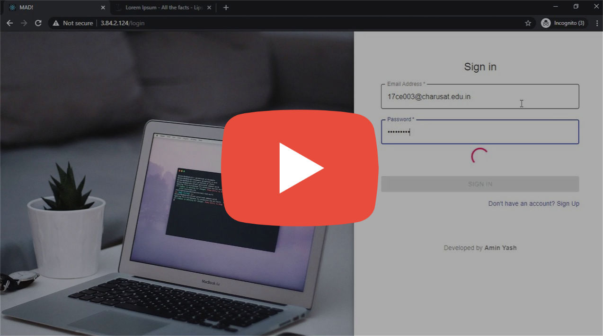

# LaTeX Assignment Reports Generator

## Demo

## Project Info
This project is divided into two parts:
1. [Backend](Backend/):
    * Backend is developed in Node.js
    * I have used Sequelize ORM library for the database management.
    * See the installation guide for backend [here](#Backend-Installation).
    * And the documentation of backend [here](Backend/README.md).
2. [Frontend](Frontend/): 
    * Frontend is developed in React with Redux.
    * For UI framework, I have used [Material UI](https://material-ui.com/).
    * See the installation guide for frontend [here](#Frontend-Installation).

## Frontend Installation
1. To install the libraries
    * `cd Frontend`
    * `npm install`

2. Testing/Development
    * For testing, you need to run the API server. 
    * Inside [`Frontend/src/axiosInstance.js`](Frontend/src/axiosInstance.js) modify the `baseURL` parameter to your API server's URL.
    * Also you have to modify `debug` parameter of [`Backend/config.js`](Backend/config.js). That will send `Access-Control-Allow-Origin` header in response, so frontend can read the respose of cross-origin requests.  
    * You can also use proxy in React. [Example here](https://create-react-app.dev/docs/proxying-api-requests-in-development/).
    
3. Build
    * `npm run build`

## Backend Installation
1. Adding the frontend static files
    * Build the React Web App.
    * Inside frontend folder, a directory named `build` will be generated.
    * Copy that directory and paste in the Backend folder.

2. Installation of LaTeX software/library
    * I have used [miktex](https://miktex.org/) which lets us compile the LaTeX file and generate the PDF. (You can use miktex in Windows too)
    * Make sure that you can execute the command `pdflatex` in your terminal, if not open Environment Variables and add the installed directory's location in `Path` variable.
    * If you need some extra packages like ragged2e and listings, create a directory and put all the downloaded packages there. Open the [`config.js`](Backend/config.js) file inside Backend directory and change the variable `latexPackagesDirectory`.

3. Installation of node modules
    * Execute this command to install libraries: `npm i`

4. Modification
    * Open `index.js` and in the `sessionInfo` dictionary, change `secret` variable's value to some random string.
    * Inside `dbSync.js`, you can add titles of assignments.
    * Modify `config.js` for database credentials. 
    * I have used **Sequelize** ORM library which can be used with MySQL, SQLite, Postgres, MS SQL...
        * I have used MySQL in this project. If you want to use other Database, read this [documentation](https://sequelize.org/master/manual/getting-started.html).

5. Run
    * `node .`